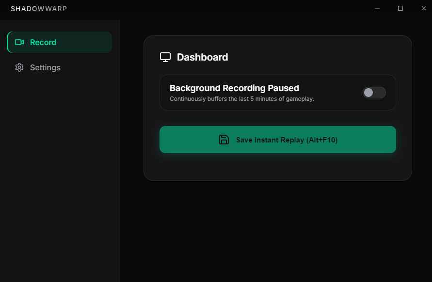
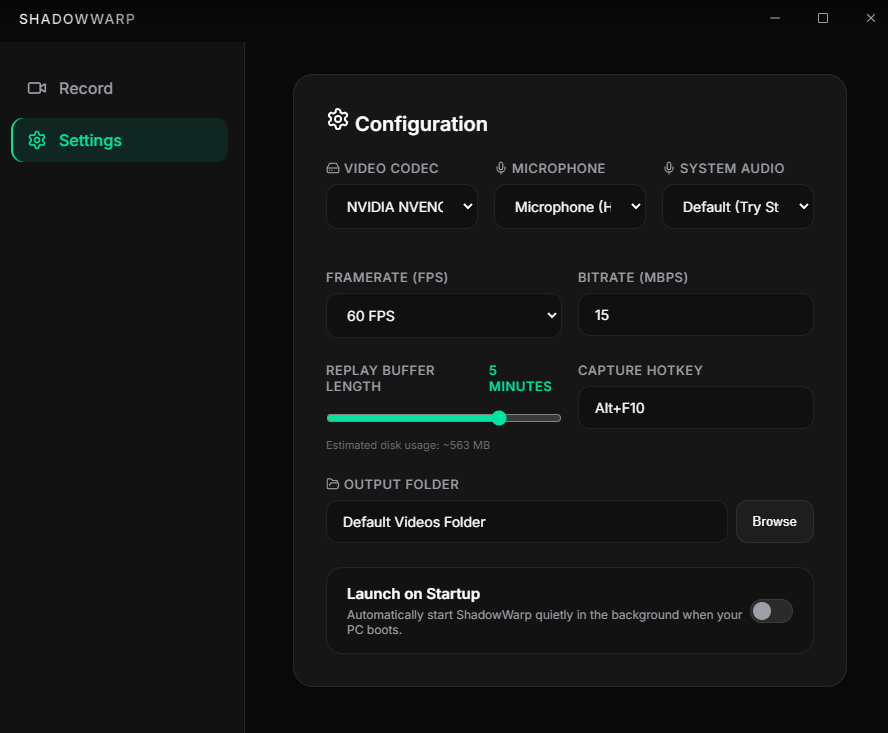

# ShadowWarp

A lightweight, open-source instant replay recorder for Windows — built as a drop-in replacement for NVIDIA ShadowPlay&apos;s Instant Replay feature.

ShadowWarp runs silently in the background, continuously buffering your screen using FFmpeg and NVENC hardware encoding. Press a hotkey, get the clip. No GeForce Experience required, no telemetry, no bloat.

---

## Screenshots




---

## Download

Grab the latest installer from the [Releases page](https://github.com/YoGoUrT20/shadowarp/releases).

---

## Features

- **Instant Replay Buffer** — continuously records your screen in the background; configurable from 5 seconds up to 15 minutes
- **One-Hotkey Save** — press your capture hotkey (default `Alt+F10`) at any moment to save the last N minutes as an `.mp4`
- **NVIDIA NVENC Hardware Encoding** — uses your GPU for near-zero CPU overhead; falls back to software x264 if needed
- **Dual Audio Capture** — records system audio (Stereo Mix / VB-Cable) and microphone simultaneously, mixed into one track
- **System Tray Integration** — lives quietly in the tray; save replays without ever opening the window
- **Launch on Boot** — optional auto-start so the buffer is always rolling
- **Configurable Quality** — set your codec, framerate (30 / 60 / 120 FPS), and bitrate independently
- **Custom Output Folder** — saves clips wherever you want

---

## How It Works

ShadowWarp uses FFmpeg&apos;s segment muxer to write your screen into a rolling series of 30-second `.ts` chunks on disk. When you hit the hotkey, it concatenates only the chunks within your configured buffer window into a final `.mp4` using stream-copy — no re-encoding, so saving is nearly instant.

Global hotkeys are captured system-wide via `uiohook-napi`, so they work even when the app is minimized or hidden in the tray.

---

## Why This Exists


NVIDIA ShadowPlay has degraded into something barely functional. Between forced GeForce Experience installs, broken overlays, random recording failures, laggy UI, and constant driver-level issues — it became genuinely unusable. ShadowWarp exists because all we ever wanted was a background buffer and a hotkey to save a clip, and ShadowPlay stopped being able to do even that reliably.

---

## Development

**Prerequisites:** Node.js, Bun, an NVIDIA GPU (for NVENC) or any GPU for software fallback.

```bash
bun install
bun run dev
```

**Build installer:**

```bash
bun run build
```

Output is in the `release/` directory.
